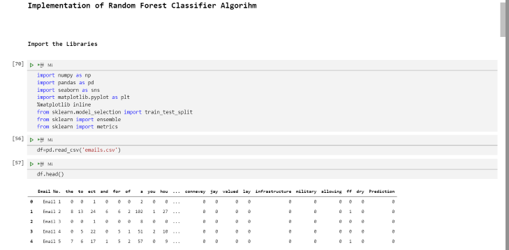

## **RANDOM FOREST CLASSIFIER**
#### INTRODUCTION
* Random forests or random decision forests are an ensemble learning method for classification, regression and other tasks that 
 operates by constructing a multitude of decision trees at training time. 

#### PURPOSE
* To understand the working of Random Forest Classifier on classification tasks.
* To get equipped with the libraries and practical implementation of the model on various datasets.

#### BREIF EXPLANATION
* Random Forest Classifier is a Supervised Machine Learning Algorithm.
* The forest it builds is an ensemble of Decision Trees usually trained with the bagging method.
* It builds multiple Decision Trees and merges them together to get more accurate and a stable prediction.

#### WORKING CONDITIONS

1. Data Exploration and Analysis.
</img>
